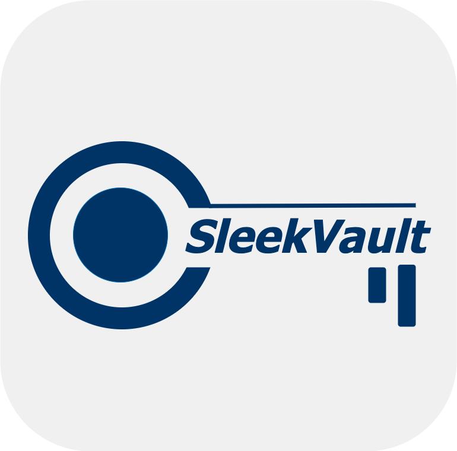
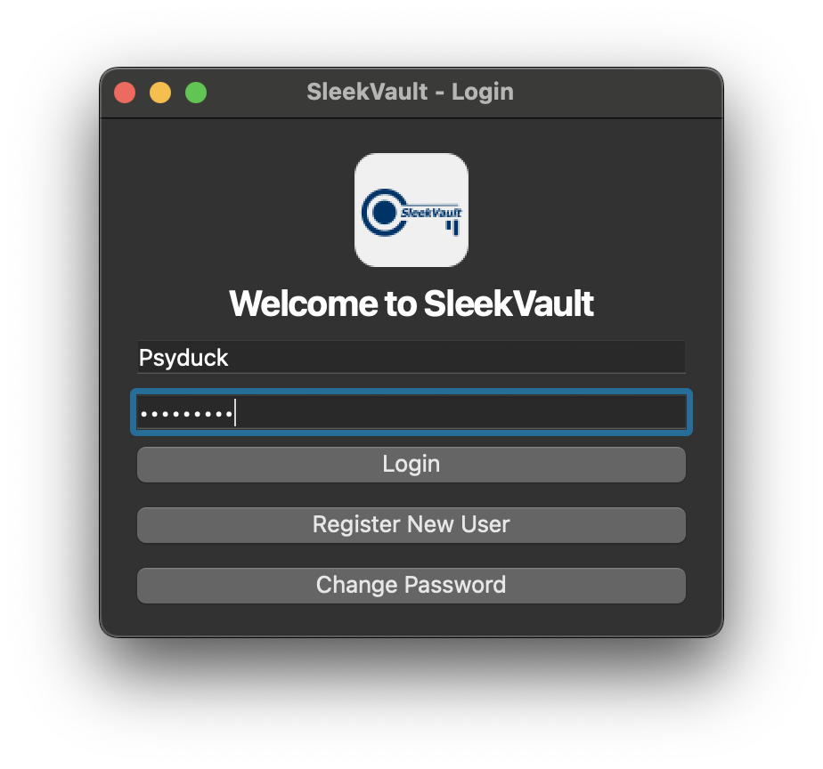
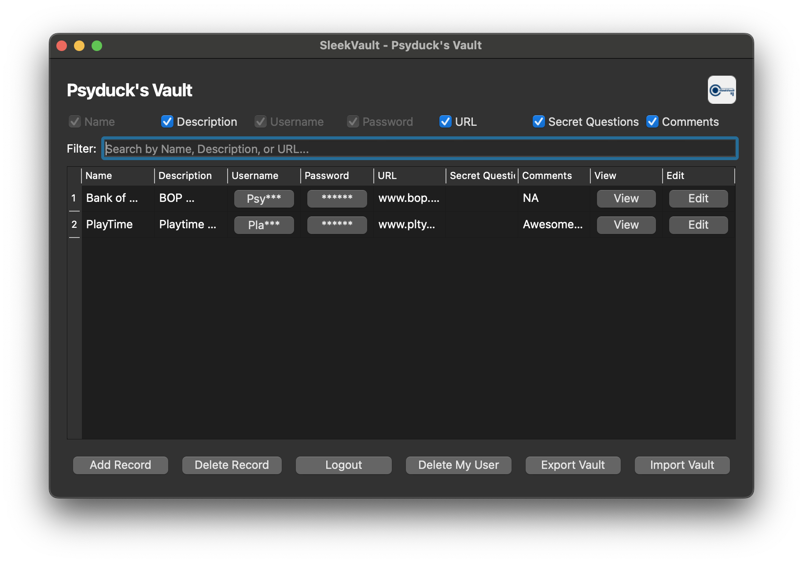

# SleekVault: Secure Desktop Credential Manager for macOS



## What is SleekVault?
SleekVault is a secure, user-friendly desktop application for managing your credentials on macOS. It supports multiple users, encrypts all your data, and provides a beautiful, customizable interface for storing and retrieving your passwords and logins.

---

## Features
- **Multi-user support**: Each user has their own encrypted vault.
- **Strong encryption**: All credentials are stored securely using industry-standard cryptography.
- **Easy registration & login**: Simple, intuitive authentication.
- **Customizable grid view**: Organize, filter, and customize how your credentials are displayed.
- **Add, edit, delete, and view credentials**: Full control over your data.
- **Copy username/password**: Copy to clipboard with masking for security.
- **Import/Export**: Backup or transfer your vault as encrypted JSON.
- **macOS native**: Packaged as a clickable app with a custom icon and branding.

---

## Screenshots

**Login Screen:**



**Vault Grid View:**



---

## Installation

### 1. Download SleekVault
- If you have a pre-built `.app` file, simply drag it to your `Applications` folder and double-click to launch.
- If you want to build from source, follow the steps below.

### 2. Build from Source (Advanced)
1. **Install Python 3.8+** (if not already installed)
2. **Install Homebrew** (if not already installed):
   ```sh
   /bin/bash -c "$(curl -fsSL https://raw.githubusercontent.com/Homebrew/install/HEAD/install.sh)"
   ```
3. **Install dependencies**:
   ```sh
   pip3 install -r sleekvault_app/requirements.txt
   ```
4. **Run the app**:
   ```sh
   python3 sleekvault_app/main.py
   ```
5. **(Optional) Build a macOS App**:
   - Install PyInstaller:
     ```sh
     pip3 install pyinstaller
     ```
   - Build the app:
     ```sh
     pyinstaller --noconfirm --windowed --icon sleekvault_app/sleekvault.icns --add-data "sleekvault_app/resources:sleekvault_app/resources" sleekvault_app/main.py
     ```
   - The `.app` will be in the `dist/` folder.

---

## Usage
1. **Launch SleekVault**
   - Double-click the app or run `python3 sleekvault_app/main.py` from Terminal.
2. **Register a new user**
   - Click "Register" and create your account.
3. **Login**
   - Enter your username and password.
4. **Manage your credentials**
   - Add, edit, delete, or view credentials in the main vault window.
   - Use the filter and column options to customize your view.
   - Copy usernames/passwords securely with the copy buttons.
5. **Import/Export**
   - Use the menu to import or export your vault as an encrypted JSON file.

---

## Data Security & Storage
- All user data is encrypted and stored in `~/Library/Application Support/SleekVault/`.
- Only you have access to your credentials. Never share your master password.

---

## Troubleshooting
- **App won’t launch?**
  - Ensure you have Python 3.8+ and all dependencies installed.
  - If you see permission errors, check that you have write access to `~/Library/Application Support/SleekVault/`.
- **Forgot your password?**
  - For security, passwords cannot be recovered. You may register a new user.
- **UI issues or crashes?**
  - Run from Terminal to see error messages: `python3 sleekvault_app/main.py`

---

## Support & Feedback
For help or to report issues, please contact the developer or open an issue on the project repository.

---

Enjoy secure, simple credential management with SleekVault!
